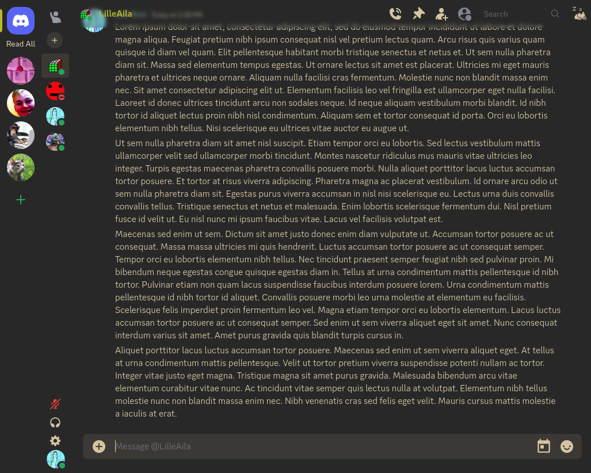

# LilleAila's Dotfiles
**My personal configuration files for Linux, using NixOS with Home-Manager.**

Riced with [nix-colors](https://github.com/Misterio77/nix-colors) using [gruvbox](https://github.com/morhetz/gruvbox) as the color scheme.

<!-- Tables work, but don't look as good -->
<!--

|  |
|:--:|
| *Hyprland, kitty and ags, all themed with nix-colors* |

|  |
|:--:|
| *Firefox minimal theme with nix-colors* |

|  |
|:--:|
| *Discord, with a tweaked UI and themed with nix-colors* |

-->

<figure>
  
  <figcaption> Hyprland, kitty and ags, all themed with nix-colors</figcaption>
</figure>
  
<figure>
  
  <figcaption> Minimal firefox theme with nix-colors</figcaption>
</figure>
  
<figure>
  
  <figcaption> Discord, with a tweaked UI and themed with nix-colors</figcaption>
</figure>

## Using
- Window Manager: [Hyprland](https://hyprland.org)
- Bar: [AGS](https://aylur.github.io/ags-docs/) ([config](https://github.com/LilleAila/ags-config))
- Terminal Emulator: [kitty](https://sw.kovidgoyal.net/kitty)
- Shell: [Zsh](https://www.zsh.org/) with [Oh my Zsh](https://ohmyz.sh/), and the [nanotech](https://github.com/ohmyzsh/ohmyzsh/wiki/Themes#nanotech) theme
- Editor(s): [Neovim](https://neovim.io) ([config](https://github.com/LilleAila/nvim-nix))
- Discord: [Vesktop](https://github.com/Vencord/Vesktop)
- Wallpapers: [AngelJumbo/gruvbox-wallpapers](https://github.com/AngelJumbo/gruvbox-wallpapers)

## Hardware
I use the following computers with this configuration:

| Type                      | Name         | Architecture | Note                        |
| ------------------------- | ------------ | ------------ | --------------------------- |
| Lenogo ThinkPad E14 Gen 5 | `e14g5`      | `x86_64`     | Main                        |
| Apple MacBook Pro 14"     | `mac-nix`    | `aarch64`    | Build with `--impure`       |
| Lenovo ThinkPad T420      | `t420-nix`   | `x86_64`     |                             |
| Lenovo Legion Y540        | `legion-nix` | `x86_64`     |                             |
| Oracle cloud A1           | `oci-nix`    | `aarch64`    |                             |

### For more info, see the [docs](/docs/main.md)

## Inspiration
- [tpwrules/nixos-apple-silicon](https://github.com/tpwrules/nixos-apple-silicon/tree/main) - Installing NixOS on m1
- [NixOS on oracle cloud](https://blog.korfuri.fr/posts/2022/08/nixos-on-an-oracle-free-tier-ampere-machine/)
- [Vimjoyer](https://www.youtube.com/@vimjoyer/featured) - Learning nix
- [System Crafters](https://www.youtube.com/watch?v=74zOY-vgkyw&list=PLEoMzSkcN8oPH1au7H6B7bBJ4ZO7BXjSZ) - Emacs from scratch
- [nix-workflow](https://ayats.org/blog/nix-workflow/)
- [natpen/awesome-wayland](https://github.com/natpen/awesome-wayland)
- [hyprland-community/awesome-hyprland](https://github.com/hyprland-community/awesome-hyprland)
- [nix-community/awesome-nix](https://github.com/nix-community/awesome-nix)
- [awsm.fish](https://github.com/jorgebucaran/awsm.fish)
- [thiscute - modularize the configuration](https://nixos-and-flakes.thiscute.world/nixos-with-flakes/modularize-the-configuration)
- [use nix repl effectively](https://aldoborrero.com/posts/2022/12/02/learn-how-to-use-the-nix-repl-effectively/)
- [Configuration Collection](https://nixos.wiki/wiki/Configuration_Collection)
- [riceyourride.com](https://riceyourride.com/best/1)
### Other peoples' dotfiles:
| User | WM | Bar | NixOS |
| ---- | -- | --- | ----- |
| [IldenH](https://github.com/IldenH/dotfiles) | Hyprland | Waybar | x |
| [fufexan](https://github.com/fufexan/dotfiles) | Hyprland | AGS | x |
| [Aylur](https://github.com/Aylur/dotfiles)| Hyprland | AGS | x |
| [ircurry](https://github.com/ircurry/cfg) | Hyprland | Waybar | x |
| [chadcat7](https://github.com/chadcat7/crystal) | Hyprland | All?? | x |
| [anotherhadi](https://github.com/anotherhadi/nixy) | Hyprland | Waybar | x |
| [Misterio77](https://github.com/Misterio77/nix-config) | Hyprland | Waybar | x |
| [iynaix](https://github.com/iynaix/dotfiles) | Hyprland | Waybar | x |
| [vimjoyer](https://github.com/vimjoyer/nixconf) | Hyprland | Waybar | x |
| [matt1432](https://git.nelim.org/matt1432/nixos-configs) | Hyprland | AGS | x |
| [BANanaD3V](https://github.com/BANanaD3V/nixos-config) | Hyprland | Waybar | x |
| [0fie](https://github.com/0fie/maika) | Hyprland | Waybar | x |
| [noib3](https://github.com/noib3/dotfiles) | BSPWM | Polybar | x |
| [rice-cracker-dev](https://github.com/rice-cracker-dev/nixos-config) | Hyprland | AGS | x |
| [end-4](https://github.com/end-4/dots-hyprland) | Hyprland | AGS |  |
| [SimonBradner](https://github.com/SimonBrandner/dotfiles) | Hyprland | AGS | x |
| [alexhulbert](https://github.com/alexhulbert/seaglass) | Hyprland | Waybar | x |
| [linuxmobile](https://github.com/linuxmobile/kaku) | Hyprland | AGS | x |
| [Kreyren](https://github.com/Kreyren/nixos-config) | Gnome | Gnome | x |
| [jacekpoz](https://git.jacekpoz.pl/jacekpoz/niksos) | Hyprland | Waybar | x |
| [TheSmallTeaBoi](https://github.com/TheSmallTeaBoi/frogix/tree/main) | Awesome | <-? | x |
